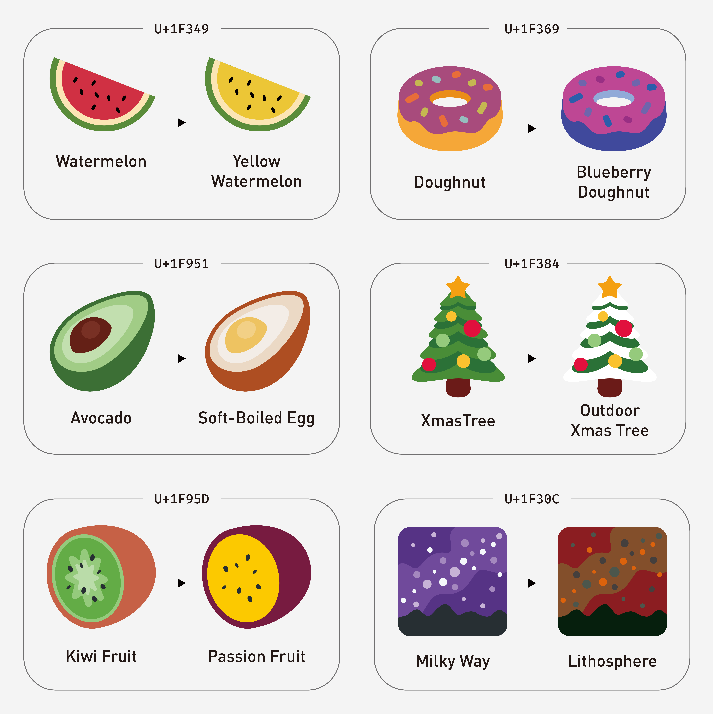
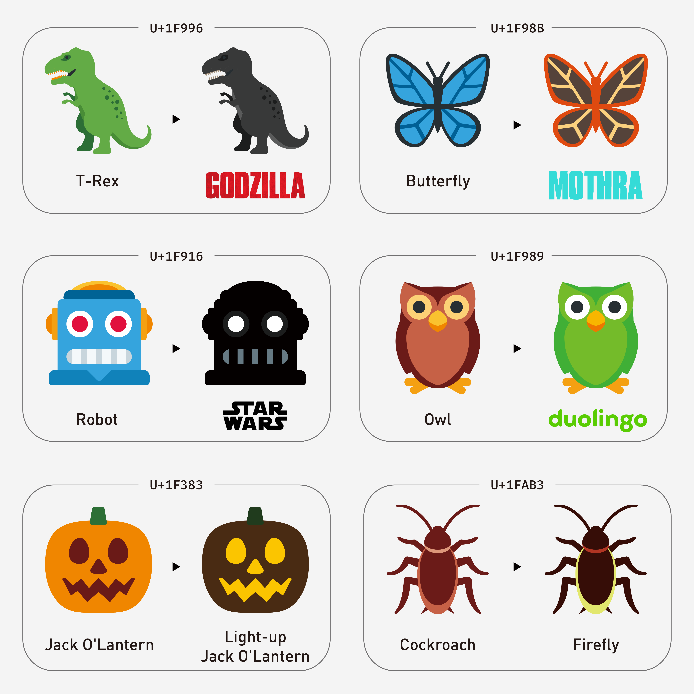
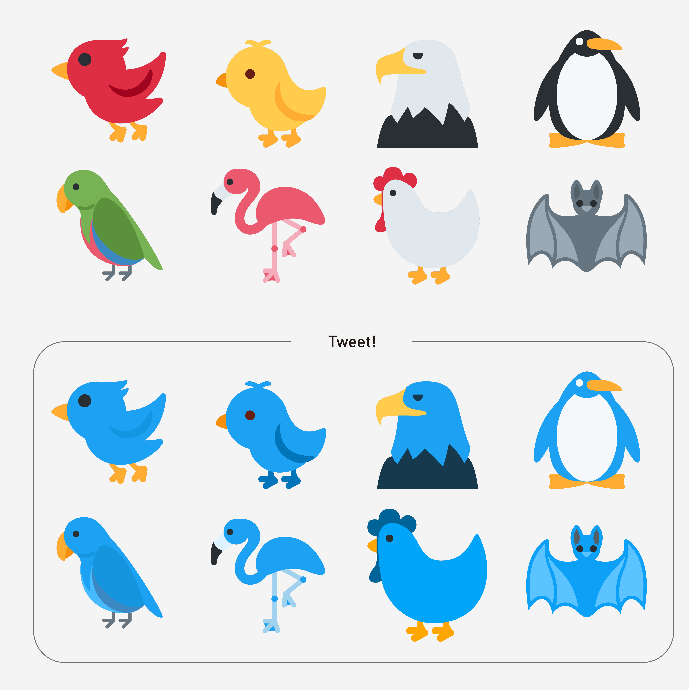
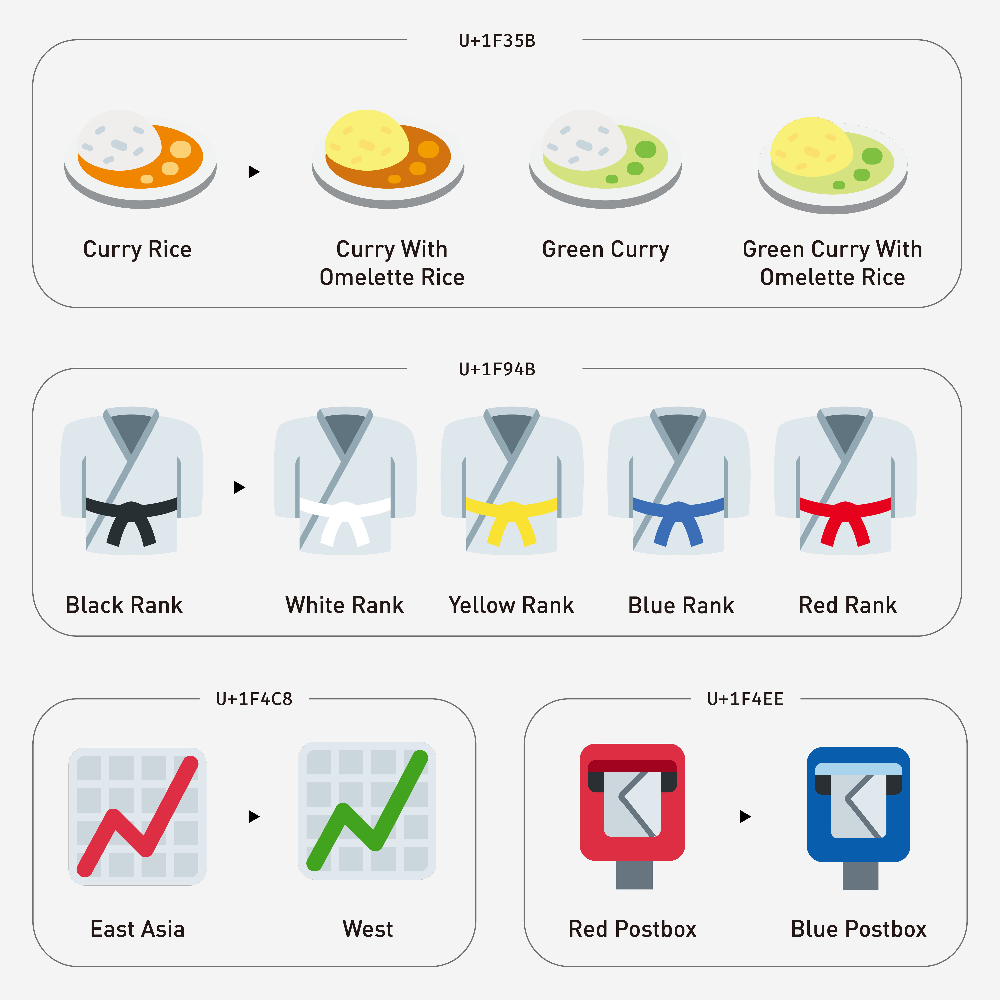

<div align="center">

<h1>🪄 Emoji Salon - Coloring Your Emoji</h1>

🔗&nbsp;&nbsp; https://emojisalon.art &nbsp;&nbsp;🔗


**Emoji Salon** allows you to customize the colors of emojis,<br> just like dressing them up by various cosmetics or coloring them by different paints.

</div>

## Introduction

In this branch, we will use [Twemoji](https://github.com/twitter/twemoji) SVG data for demonstrations. You can select, color, and download your creation as an SVG or PNG for your use.

Additionally, if you intend to use your creation on the website, you can make use of the [Twemoji-colr](https://github.com/mozilla/twemoji-colr) webfont along with modified CSS. The HTML and CSS codes can be found in the _Share and More_ panel (click the _Share and More_ button on the desktop website)

Moreover, the `colrv0` branch demonstrates the use of `COLR/CPAL v0` color fonts to achieve the same result as svg approach. And the `colrv1` shows the advanced experiment about `COLR/CPAL v1` by using Noto Color Emoji.

## Usage

### Extend Emoji & For fun







### Cross-cultural Design



### Accessibility

For some people with color vision deficiencies or color blindness, it may be challenging to correctly identify certain emojis that are too similar in color or overly vibrant.

For instance, 🇮🇹 Italy and 🇮🇪 Ireland⁠; 🇷🇴 Romania and 🇹🇩 Chad⁠; 🇱🇻 Latvia and 🇦🇹 Austria⁠; 🇲🇨 Monaco and 🇮🇩 Indonesia⁠.

However, most current emoji designs do not take them into consideration. This website aims to provide easily distinguishable emojis for such individuals.

See more:

- [Emoji And Low Vision - Veronica With Four Eyes](https://veroniiiica.com/emoji-and-low-vision/)
- [Are you emoji colour blind?⁠ - Colour Blind Vision](https://www.facebook.com/ColourBlindVision/posts/are-you-emoji-colour-blinda-strange-concept-to-say-nevertheless-how-many-times-h/678523570194699/)

## Build

```
# develop on local
npm install
npm start

# build a single html page
# if fail, remove `public` and `.parcel-cache` folders and retry
npm run build
```

## Related

- [Node.js](https://nodejs.org/)
- [FontKit](https://github.com/foliojs/fontkit)
- [Emoji Mart](https://github.com/missive/emoji-mart)
- [Coloris](https://github.com/mdbassit/Coloris)
- [Parcel](https://parceljs.org/)
- [Bootstrap](https://getbootstrap.com/)

## Browser Compatibility

### SVG

- Mainstream browsers support displaying the `<svg>` tag.

### Webfont

- `COLR` (_Color_) and `CPAL` (_Color Palette_) are OpenType technologies to enable the use of multi-colored glyphs and emoji in fonts. Designer can create color font that contain multiple layers of color information, allowing for complex and vibrant color rendering. User can change the layer's color by override `@font-palette-values` attribute.
- `COLR/CPAL v1` is an extended version of `COLR/CPAL v0`, designed to elevate the capabilities of color fonts, such as gradient color support.
- For example:

```
@font-palette-values --overridePalette {
  font-family: "Twemoji";
  base-palette: 0;
  override-colors:
    0 #00ffbb,
    1 #007744;
}

.mod-emoji {
  font-family: "Twemoji";
  font-palette: --overridePalette;
}
```

- However, the compatibility of `COLR/CPAL` may vary depending on browsers. Currently, most browsers support `COLR/CPAL v0` font format, with the exception of Safari 17.

|         | Chrome | Edge  | FireFox |       Safari        |
| ------: | :----: | :---: | :-----: | :-----------------: |
| Version | 117.0  | 117.0 | 117.0.1 | 16.0 / Monterey\*\* |
| Twemoji |   ✅   |  ✅   |  🟠 \*  |         ✅          |

|         |    Safari on iOS     |  Chrome on iOS\*\*\*  | Chrome on Android  |
| ------: | :------------------: | :-------------------: | :----------------: |
| Version | 16.5 / iOS 16.5 \*\* | 100.0 / iOS 16.5 \*\* | 104.0 / Android 12 |
| Twemoji |          ✅          |          ✅           |         ✅         |

- `*`: In Firefox, both rendering and coloring functions are available. However, the result can not be rendered into an image. When you try to download the creation, it will be the original version and not the color overridden one.
- `**`: **Currently, Safari below 17 are support `COLR/CPAL v0` color font, however, Safari 17 (on iOS 17 or macOS Sonoma) does not support anymore.** Reference: COLR support vanished between Safari 16 and 17: [WebKit Bugzilla Bug 262223](https://bugs.webkit.org/show_bug.cgi?id=262223)
- `***`: All third-party browsers on iOS are based on the same WebKit kernel as Safari.
- You can use [ChromaCheck (@RoelN)](https://pixelambacht.nl/chromacheck/) or [Color fonts live examples (@yoksel)](https://yoksel.github.io/color-fonts-demo/) to see whether your browser support `COLR/CPAL v0` or `COLR/CPAL v1` format.

## Copyright

<div align="center">

</div>

Your creation is based on [Twemoji](https://github.com/twitter/twemoji), license under [CC-BY 4.0](https://creativecommons.org/licenses/by/4.0/) (graphic).

This license enables reusers to distribute, remix, adapt, and build upon the material in any medium or format, so long as attribution is given to the creator. The license allows for commercial use.

I do not own any copyright to your work.

## See More...

- [OpenType COLR (Color Table) Spec - Microsoft](https://learn.microsoft.com/en-us/typography/opentype/spec/colr)
- [OpenType CPAL (Color Palette Table) Spec - Microsoft](https://learn.microsoft.com/en-us/typography/opentype/spec/cpal)
- [COLR/CPAL(v0) Font Formats - Can I USe...](https://caniuse.com/colr)

## Special Thanks

- [justfont](https://justfont.com/)
- Cover Image by [Bilakis](https://www.pexelscom/zh-tw/@bilakis/) via [Pexels](https://www.pexels.com/zh-tw/photo/15545362/)
